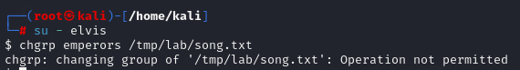
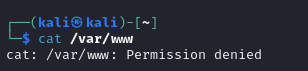
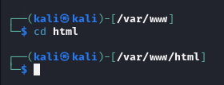

# Linux Permissions


Name: Xu Matthias Chen   
Klasse: 4AHITS   
Fach: ITSE   
Datum: 02.03.2026        

---

### Vorbereitung der Übungsumgebung
Betrachte folgendes Skript und finde heraus was es macht. Anschließend führe das Skript als User kali mit sudo aus, um die Laborumgebung einzurichten:
```
#!/bin/bash

# Gruppen anlegen
groupadd music
groupadd wrestle
groupadd emperors

# User anlegen und Gruppen zuweisen
useradd -m -G music elvis
useradd -m -G music,wrestle blondie
useradd -m -G wrestle hogan
useradd -m -G emperors nero

# Passwörter auf 'kali' setzen
echo "elvis:kali" | chpasswd
echo "blondie:kali" | chpasswd
echo "hogan:kali" | chpasswd
echo "nero:kali" | chpasswd

# Lab-Struktur vorbereiten
mkdir -p /tmp/lab/gigs /tmp/lab/drafts
echo "Draft" > /tmp/lab/drafts/lyrics.txt
echo "Plans" > /tmp/lab/wrestle_plans.txt
chown -R root:root /tmp/lab
chmod -R 755 /tmp/lab
```

#### Arbeitsschritte

Als erstes ein Shell-Script mit 
```
vim permission.sh  
```

und Inhalt hineinkopierten:

```
#!/bin/bash

# Gruppen anlegen
groupadd music
groupadd wrestle
groupadd emperors

# User anlegen und Gruppen zuweisen
useradd -m -G music elvis
useradd -m -G music,wrestle blondie
useradd -m -G wrestle hogan
useradd -m -G emperors nero

# Passwörter auf 'kali' setzen
echo "elvis:kali" | chpasswd
echo "blondie:kali" | chpasswd
echo "hogan:kali" | chpasswd
echo "nero:kali" | chpasswd

# Lab-Struktur vorbereiten
mkdir -p /tmp/lab/gigs /tmp/lab/drafts
echo "Draft" > /tmp/lab/drafts/lyrics.txt
echo "Plans" > /tmp/lab/wrestle_plans.txt
chown -R root:root /tmp/lab
chmod -R 755 /tmp/lab
```

Mit `chmod +x permission.sh` Execution Flag setzen.

Und mit `sudo ./permission.sh` es ausführen.

Dieses Shell-Script legt users an, groups und setzt die passwörter der user auf Kali. Und die Lab-Struktur wird vorbereitet.

### Übung (Analyse und Symbolic Mode)
Rechte auslesen: 
1. Ermittle die Permissions, den User Owner und den Group Owner der Datei `/tmp/lab/wrestle_plans.txt`?

```
┌──(kali㉿kali)-[~]
└─$ ls -l /tmp/lab/wrestle_plans.txt 
-rwxr-xr-x 1 root root 6 May 11 06:05 /tmp/lab/wrestle_plans.txt
```

User:
Read, Write and Execute

Group:

Read and Execute

2. Private Files: Erstelle eine Datei `notes.txt.` Ändere die Permissions so, dass der `other`-Klasse (o) das Read-Recht (r) entzogen wird. Nutze den symbolischen Modus von `chmod`.

```
touch notes.txt
chmod o-r notes.txt 
```

3. Group Sharing: Setze die Permissions für `notes.txt` so, dass die `group` (g) die Datei lesen (r) und schreiben (w) darf, während der `user` (u) alle Rechte behält und `others` (o) keinerlei Zugriff haben. Verwende für die Änderung einen einzigen `chmod` Aufruf.

```
chmod u+r+w+x,g+r+w,o-r-w-x notes.txt
oder
chmod u=rwx,g=rw,o= notes.txt 
```

4. Skript-Vorbereitung: Erstelle die Datei `myscript.sh`. Welchen Befehl nutzt du, um dem `user` (u) und der `group` (g) das Recht zu geben, dieses File auszuführen (x)?

```
touch myscript.sh
chmod ug+x myscript.sh
```

5. Kollektive Änderung: Erstelle die Datei `data.txt`. Entziehe mit einem einzigen Befehl im symbolischen Modus sowohl der `group` (g) als auch `others` (o) die Write- (w) und Execute-Rechte (x) für die Datei `data.txt`.

```
touch data.txt
chmod go-wx data.txt
```
### Übung (Ownership und Gruppenkollaboration)

1. 
```
sudo su 
visudo 
```
und dann
```
blondie ALL=(root) /usr/bin/mv
```

hinzufügen in irgendeine Zeile

2. Group Change:

Mit `su - blondie` zum Benutzer blondie wechseln

Mit `touch ~/song.txt` die Datei erstellen.

Mit `sudo mv ~/song.txt /tmp/lab/` die Song-Datei ins /tmp/lab/ moven.

Mit `chgrp music /tmp/lab/song.txt` den Group Owner auf music ändern.

3. Experiment:

Mit `sudo blondie` wechselt man den User, aber die Umgebung ist noch beim alten User in dem Fall root.

Mit `sudo - blondie` wechselt man den User, muss sich anmelden und man ist gleich in `home/blondie` und nicht `home/root`.

4. User Transfer: 

Mit `chown elvis /tmp/lab/song.txt` changed man den owner auf elvis.

5. Wrestler-Szenario:

Mit `su - hogan ` Benutzer wechseln.

Mit `touch ~/training.txt` mit Datei erstellen und mit `sudo mv ~/training.txt /tmp/lab/` moven ins `tme/lab/` moven. Davor muss man in visudo `hogan ALL=(root) /usr/bin/mv` hinzufügen am mv zu erlauben.

Dann `chgrp wrestle /tmp/lab/training.txt` und `chmod g=rw,o= /tmp/lab/training.txt` um einmal den owner zu ändern und die Rechte auf g und o zu vergeben.

6. Einschränkungen:

Man müsste `chgrp emperors /tmp/lab/song.txt` ausführen.

 

Es funktioniert nicht, weil elvis nicht der Gruppe angehört -> er kann nur die Gruppe ändern, wenn er in der Gruppe wäre.


### Übung (Directory Permissions und Octal Notation)

1. Oktale Umwandlung:

rwxr-xr-x  -> 755
rw-rw----  -> 660
rwx------  -> 700

2. Pub-Verzeichnis:


Mit `mkdir /home/kali/pub` ein Verzeichnis namens pub im home/kali erstellen.
Danach mit `chmod 751 /home/kali/pub` die Rechte verteilen.

3. Recursive Lockdown:

```
chmod -R g=rw,o= /tmp/lab/drafts/
```

4. Search Permission:

```
chmod o-r+x /home/kali
```

5. Analyse:

Sie können da nicht mehr hinein, weil das x nicht gesetzt ist bei dem Verzeichniss -> kein cd ist möglich für user und groups. Wenn man x setzt dann würde es funktionieren.

### Übung (Webserver Directory Permissions)

```
sudo chmod o-r /var/www   
```

Others r-permission entfernen.



`cd /var/www` darf man, weil man nur read-permissions genommen hat und nicht x entfernt hat.



Mit 
```
┌──(kali㉿kali)-[~]
└─$ sudo chmod o+r,o-x /var/www
```

die r Flag hinzufügen und x Flag entfernen.
